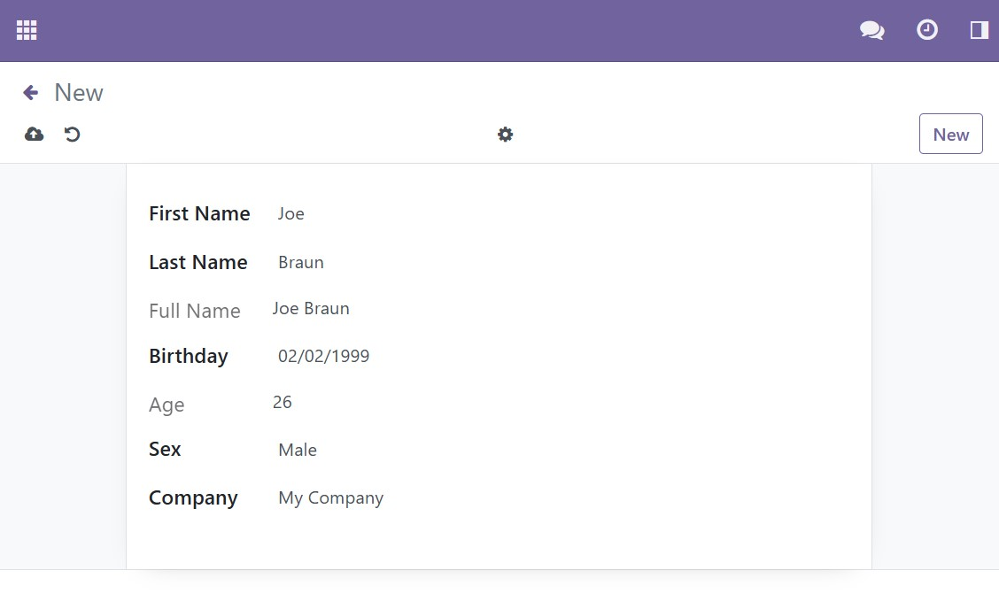
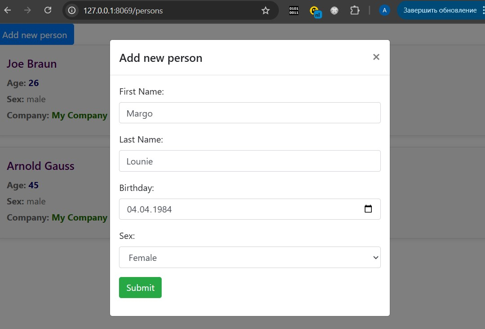
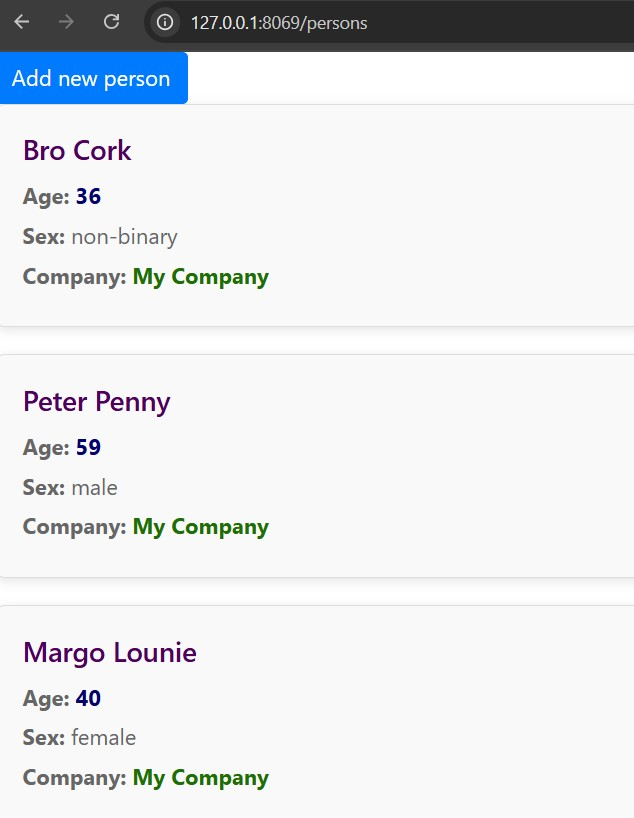
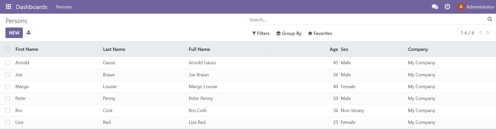

# Module Persons for Odoo 16.0

## Backend
### Model ```Persons```:
```  
first_name* – Text;  
last_name*  – Text;  
full_name   – compute = first_name + last_name;  
birthday    – Date;  
age         – compute = from birthday;  
sex         – Selection: male, female, non-binary;  
company_id* – Many2one (res.company)  
``` 

### Views:
* List View  
* Form View  

## Frontend
* URL: ```/persons ```
  View last 5 record from Persons 
* Person card:
```angular2html
full_name
sex
age
company_name 
```

## Web Client Odoo
* Add new Person (via modal Form)

---

## Run with Docker containers:
```bash
docker-compose up --build
```

## Run Odoo:
   - [http://127.0.0.1:8069/web](http://127.0.0.1:8069/web)


### Demo
  
  
  
  

---

### Contact
Feel free to contact: u123@ua.fm
